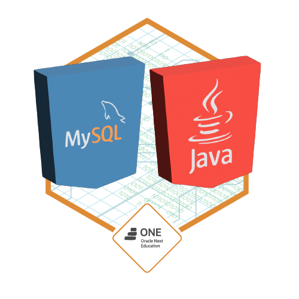

# Challenge One

## Hotel Alura 
> Bem-vindos este é um projeto que desenvolvir usando jdbc, sql, mysql, java swing e algumas librarys.

## Desafio:
- Desenvolver uma aplicação para Desktop com conexão ao Banco de Dados.

## Requisitos do desafio:
1. Sistema de autenticação de usuários para que somente usuários pertencentes ao hotel possam acessar o sistema
2. Permitir criar, editar e excluir uma reserva para clientes
3. Pesquisar na base de dados toda a informação de clientes e reservas
4. Registrar, editar e excluir os dados dos hóspedes
5. Calcule o valor da reserva com base no número de dias da reserva e uma taxa diária com o valor atribuído por você na moeda Real. Por exemplo, se tivermos uma reserva de 3 dias e o valor de nossa diária for de R$20 devemos multiplicar esses 3 dias pelo valor da diária, totalizando R$60. Tudo isso deve ser feito automaticamente e mostrado ao usuário antes de salvar a reserva
6. Banco de dados para armazenar todos os dados solicitados anteriormente

